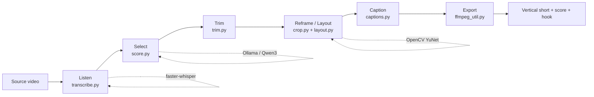

# Architecture

Think of the whole thing as an editing-bay assembly line. Each station does one job, takes
a path and a `Config`, and hands its output to the next. No station holds hidden state —
that's what makes the pipeline easy to test, swap, or extend.

## The line

**1. Listen — `transcribe.py`**
faster-whisper turns audio into words *with timestamps*. Word-level timing is the backbone:
scoring needs it to choose boundaries, captions need it to land each highlight on the right
frame, and silence-trimming needs it to find the gaps. Device is auto-detected via
ctranslate2 (CUDA if present, else CPU at int8).

**2. Select — `score.py`**
The transcript is compressed into timestamped lines and handed to a local Ollama model
(`qwen3:8b` by default) with `format: json`, thinking disabled. The model returns clip
boundaries, a title, an on-screen **hook** headline, a **virality score** (0–100), and a
reason. We never trust the raw JSON — `_clean()` clamps every field to sane bounds, drops
overlaps, and sorts by score.

**3. Trim — `trim.py`**
Silence trimming runs purely on word timestamps: gaps between words longer than
`SILENCE_MAX` are cut out and the remaining spans are concatenated (`ffmpeg_util.cut_spans`),
so a clip full of pauses becomes tightly edited without touching a single pixel.

**4. Reframe / Layout — `crop.py` + `layout.py`** (the hard one)
YuNet detects the largest face every few frames on a downscaled copy (speed). Raw
detections are jittery, so we run a **forward + backward exponential moving average** and
average the two passes — this glides the virtual camera and removes lag bias. We crop the
largest 9:16 (or 1:1 / 16:9) window that fits the source and slide it along the tracked
axis. A punch-in zoom subtly tightens the frame on emphasized words. Three **layouts** share
this stage:
- **Fill** — single tracked speaker, full frame.
- **Split** — the tracked speaker on top, a supplied gameplay/B-roll clip looped and
  cover-cropped on the bottom.
- **Stream** — auto-detects a stationary webcam box in a Twitch-style VOD (clustering YuNet
  hits into a stable rectangle) and stacks facecam over the full gameplay frame automatically,
  falling back to Fill if no facecam is found.

Frames are piped as raw BGR into ffmpeg so cropping, zoom, layout compositing, and encoding
(NVENC when available) happen in as few passes as possible.

**5. Caption — `captions.py`**
Words are grouped into short lines (breaking on pauses, wrapped inside the frame). For each
word we emit an ASS event where that word is recolored to the accent and scaled up — the
"active word pops" look — plus a heuristic keyword-emphasis pass that keeps a line's key
word tinted even when it's not the active one. Three style presets (`karaoke`, `boxed`,
`bold`) and a persistent hook headline round it out. Captions are burned in the **same**
ffmpeg pass as reframing wherever possible — no extra encode.

**6. Export — `ffmpeg_util.py` + the above**
Everything is h264 / yuv420p / aac so clips play anywhere. NVENC when available, libx264
otherwise.

## Optional add-ons

- **Auto B-roll (`broll.py`)** — opt-in. Picks a few keyword moments from the transcript,
  searches Pexels for matching stock footage, and overlays it full-frame for a few seconds
  before returning to the speaker (Fill layout only). Degrades silently to "no cutaway" if
  no `PEXELS_API_KEY` is set or a search misses — never blocks the render.
- **Regenerate one clip (`pipeline.render_clip`)** — the slow stages (transcribe + score)
  run once per upload and are kept in memory; any single clip can be re-rendered with new
  settings (caption style, layout, aspect) without repeating them.
- **Brand kit** — a small `brand.json` persists your accent color, caption font, and default
  caption style as the baseline for every future job.

## Why this shape

- **Stateless stages.** Each function takes a path + `Config` and returns a path (or a small
  dict). Easy to test in isolation, easy to swap, easy to run out of order for a re-render.
- **The model is replaceable.** Scoring quality is bounded by the LLM; bump `CLIPPER_MODEL`
  to trade VRAM for taste without touching code.
- **Guardrails at every boundary.** LLM JSON is clamped, not trusted. Network fetches (B-roll)
  degrade to a no-op. Bad UI overrides are dropped, not 500'd.
- **One heavy dependency.** ffmpeg does the media muscle; Python does the orchestration.

## Where the cost is

Transcription scales with source length. Scoring is a single model call. Reframing scales
with clip length × count (it decodes every frame) and is usually the dominant cost — face
detection runs on downscaled frames and folding captions into the same encode keeps this to
one pass per clip instead of two or three. On a 12 GB NVIDIA card, a 10-minute source with 6
clips is minutes, not hours.
